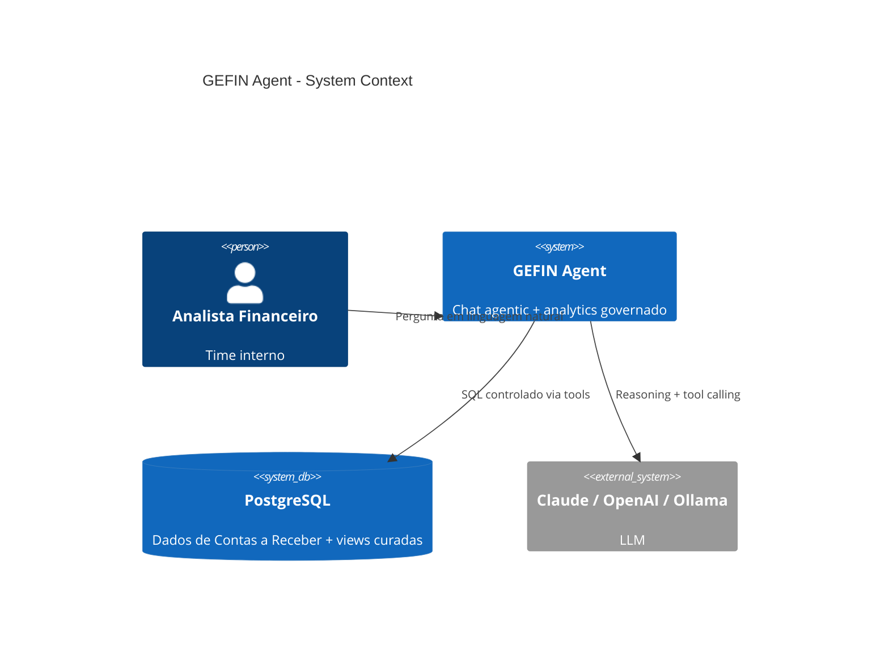
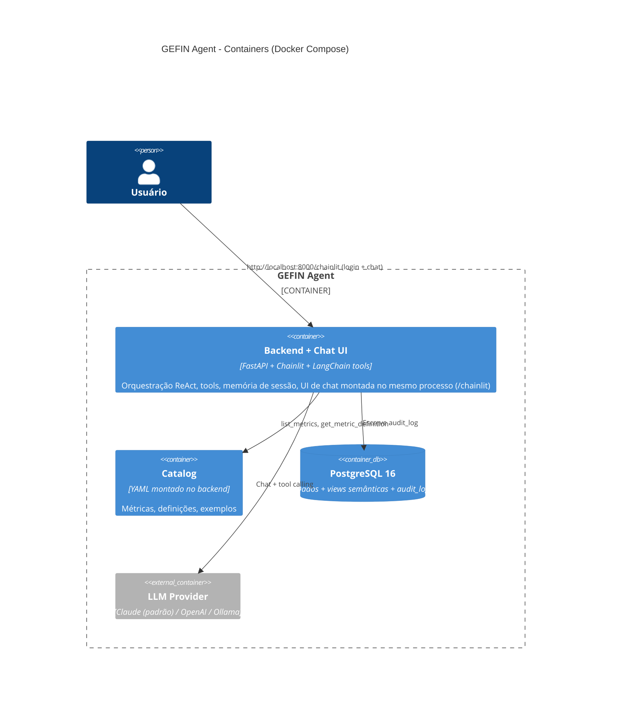
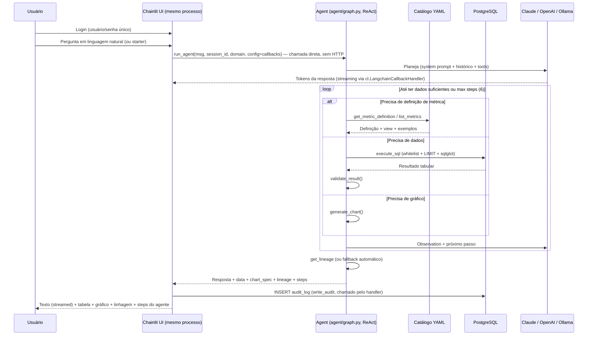

# GEFIN Agent — High-Level Architecture (MVP Prototype)

**Status:** Alinhado com a implementação atual (2026-08-06)  
**Objetivo:** Sistema agentic de analytics financeiro (Contas a Receber) em Docker, adequado a portfólio.

**Princípios:**
- Single-agent com loop **Plan → Tools → Observe → Reflect** (ReAct)
- Camada semântica (views) + catálogo leve (YAML)
- Linhagem visível em toda resposta
- LLM configurável: **Claude (padrão)** · OpenAI · Ollama (opcional)
- Sobe com `docker compose up --build`

---

## 1. Diagrama de Contexto (C4 nível 1)



---

## 2. Diagrama de Containers (C4 nível 2)



**Nota:** O serviço `ollama` existe no `docker-compose.yml` com `profiles: [ollama]` — só sobe se você usar `--profile ollama`.

---

## 3. Fluxo Agentic (Sequência)



---

## 4. Arquitetura Lógica do Agente

```
┌─────────────────────────────────────────────────────────────┐
│                     GEFIN Agent (single)                    │
│  ┌─────────────┐  ┌──────────────┐  ┌────────────────────┐  │
│  │   Planner   │→ │  Tool Router │→ │     Reflector      │  │
│  │  (LLM)      │  │              │  │  (LLM + rules)     │  │
│  └─────────────┘  └──────────────┘  └────────────────────┘  │
│         │                │                     │            │
│         ▼                ▼                     ▼            │
│  ┌──────────────────────────────────────────────────────┐   │
│  │                     Tools                            │   │
│  │  • list_metrics / get_metric_definition              │   │
│  │  • execute_sql (whitelist + sqlglot + LIMIT)         │   │
│  │  • validate_result                                   │   │
│  │  • generate_chart                                    │   │
│  │  • get_lineage                                       │   │
│  └──────────────────────────────────────────────────────┘   │
│         │                                                   │
│         ▼                                                   │
│  ┌──────────────┐     ┌──────────────┐                      │
│  │ Session      │     │ Audit Logger │                      │
│  │ Memory       │     │ (audit_log)  │                      │
│  └──────────────┘     └──────────────┘                      │
└─────────────────────────────────────────────────────────────┘
```

**Implementação:** `backend/app/agent/graph.py` (loop ReAct explícito, não StateGraph).

---

## 5. Camada de Dados (MVP)

```
PostgreSQL
├── raw (não exposto ao agente)
│   ├── customers
│   ├── invoices
│   └── payments
│
├── semantic (views whitelisted — ÚNICA camada que o agente enxerga)
│   ├── vw_ar_open_items
│   ├── vw_ar_aging
│   ├── vw_ar_customer_summary
│   ├── vw_ar_kpi_daily
│   └── vw_ar_dso
│
└── system
    └── audit_log
```

**Regra de ouro:** o tool `execute_sql` só aceita `SELECT` contra as views da lista branca (validado com **sqlglot**).

---

## 6. Catálogo Leve

Arquivo: `catalog/metrics.yaml`

Contém métricas, dimensões, views e exemplos de perguntas.  
O agente **deve** consultar o catálogo antes de gerar SQL complexo.

---

## 7. Stack Técnica (implementação atual)

| Camada              | Tecnologia                                      |
|---------------------|-------------------------------------------------|
| Orquestração        | Docker Compose                                  |
| Banco               | PostgreSQL 16                                   |
| Agente              | Python 3.12 + FastAPI + LangChain tools (ReAct) |
| LLM (padrão)        | **Anthropic Claude** (`langchain-anthropic`)    |
| LLM (alternativas)  | OpenAI / Ollama                                 |
| Chat UI             | Chainlit (montado no FastAPI) + Plotly          |
| Catálogo            | YAML + Pydantic-style loader                    |
| Validação SQL       | sqlglot + whitelist de views                    |
| Observabilidade     | Logs estruturados + tabela `audit_log`          |

### Providers de LLM (`LLM_PROVIDER`)

| Valor        | Classe LangChain     | Variáveis necessárias      |
|--------------|----------------------|----------------------------|
| `anthropic`  | `ChatAnthropic`      | `ANTHROPIC_API_KEY`        |
| `openai`     | `ChatOpenAI`         | `OPENAI_API_KEY` (+ base)  |
| `ollama`     | `ChatOllama`         | `OLLAMA_BASE_URL`          |

---

## 8. Estrutura de Pastas (repo)

```
gefin-agent/
├── docker-compose.yml
├── .env.example
├── README.md
├── catalog/
│   └── metrics.yaml
├── db/
│   └── init/
│       ├── 01_schema.sql
│       ├── 02_sample_data.sql
│       └── 03_views.sql
├── backend/
│   ├── Dockerfile
│   ├── requirements.txt
│   ├── chainlit.md            # tela de boas-vindas do Chainlit
│   └── app/
│       ├── main.py            # monta o Chainlit + /health + /catalog
│       ├── chainlit_app.py    # UI de chat (auth, streaming, elementos)
│       ├── agent/
│       │   ├── graph.py      # loop ReAct
│       │   ├── tools.py      # 6 tools + guardrails
│       │   ├── prompts.py
│       │   └── memory.py
│       ├── catalog/loader.py
│       ├── db/connection.py
│       └── audit/logger.py
└── docs/
    ├── ARCHITECTURE.md
    ├── REQUIREMENTS.md
    └── PROTOTYPE_PLAN.md
```

---

## 9. Decisões de Design (portfólio)

1. **Single-agent + tools** em vez de text-to-SQL puro → arquitetura agentic real.
2. **Views + catálogo** → padrão Agentic Data Stack (LLM não vê tabelas brutas).
3. **Linhagem sempre visível** → diferencial de governança.
4. **Claude como padrão** → melhor tool calling; Ollama disponível via profile.
5. **Caminho de evolução claro** → Fase 2: contas a pagar + Iceberg + OpenMetadata.

---

*Documento alinhado com o código em `gefin-agent/` (2026-08-06).*
